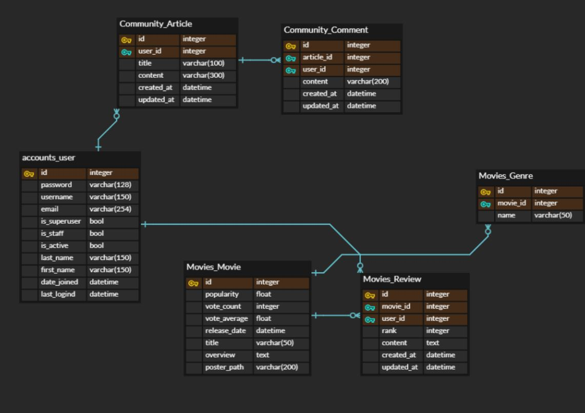

# README

## 2020.11.19 ~ 2020.11.26 Final Project (전원표, 우진하)

## Backend Readme - 우진하


[TOC]

### 목표

* Django REST API 서버 & Vue.js 을 통해 Backend와 Frontend의 서비스를 설계
* The Movie Database(TMDB)를 통해 영화 데이터 수집 및 영화 정보를 표시해주는 서버 구현
* 영화 정보 기반 추천 서비스 구성
* 커뮤니티 서비스 구성
* 영화 정보에 대한 리뷰 및 평점 등록 서비스 구성


### 분업

* Frontend: Vue.js를 통한 프론트 서버 구현 - 전원표
* Backend: DRF를 통한 백 서버 구현 - 우진하


### ERD




### 영화 데이터 받아오기

* dumpdata.py

  * TMDB API 요청으로 영화데이터 약 100개를 받아온다.

  * dumpdata에 넣은 후 필요한 데이터만 가지고 json 파일로 encode

  * ```python
    import json
    # import requests
    genre_result = [
      # 장르id <-> 장르 name 연결
    ]
    
    result = [
        # TMDB에서 받아온 영화데이터
    ]
    
    dumpdata = []
    for genre in genre_result:
      dumpdata.append({
        "model" : "movies.genre",
        "pk": genre.get("genre_ids"),
        "fields": {
          'name': genre.get('name')
        }
      })
    
    for i in range(len(result)):
      dumpdata.append({
        "model":"movies.movie",
        "fields": {
          "title":result[i].get("title"),
          "release_date":result[i].get("release_date"),
          "popularity":result[i].get("popularity"),
          "vote_count":result[i].get("vote_count"),
          "vote_average":result[i].get("vote_average"),
          "overview":result[i].get("overview"),
          "poster_path":f'https://image.tmdb.org/t/p/w500/{result[i].get("poster_path")}',
          "genre_ids":result[i].get("genre_ids"),
        }
      }
      )
    
    
    with open('movies.json', 'w', encoding='UTF-8') as file:
        file.write(json.dumps(dumpdata, ensure_ascii=False))
    ```


### accounts

> Django에서 제공하는 AbstractUser 모델을 사용

* views.py

  * Signup 함수를 통해 비밀번호의 Serializer 데이터 직렬화를 진행

  * passwordcheck 함수를 만들어 간단한 패스워드로서의 가입을 막는다

    * ```python
      def passwordcheck(pw):
          li = [0, 0, 0]
          for i in range(len(pw)):
              li[0] += 1
              if 65 <= ord(pw[i]) < 91 or 97 <= ord(pw[i]) < 123:
                  li[1] += 1
              elif 48 <= ord(pw[i]) < 58:
                  li[2] += 1
          if li[1] == 0 or li[2] == 0 or li[0] < 5:
              return 0
          else:
              return 1
      ```


### community

> Article, Comment 모델을 작성.
>
> User - Article, Article-Comment, User-comment을 ForeignKey로 연결.

* serializers.py

  * seializer를 통한 데이터 직렬화 진행.

  * get_user_name함수를 통한 user_name 받아오기.

  * ```python
    from rest_framework import serializers
    from .models import Article, Comment
    
    
    class ArticleSerializer(serializers.ModelSerializer):    
        user_name = serializers.SerializerMethodField()
        
        def get_user_name(self, obj):
            return obj.user.username
            
        class Meta:
            model = Article
            fields = '__all__'
            # fields = ('user', 'title', 'content', 'created_at', 'updated_at', 'user_ids',)
            read_only_fields = ('user', 'created_at', 'updated_at',)
            
    
    
    class CommentSerializer(serializers.ModelSerializer):    
        user_name = serializers.SerializerMethodField()
        
        def get_user_name(self, obj):
            return obj.user.username
        class Meta:
            model = Comment
            # fields = ('article', 'user', 'content', 'created_at', 'updated_at',)
            fields = '__all__'
            read_only_fields = ('user', 'article', 'created_at', 'updated_at',)
    
    ```

* views.py

  * article에 관한 read, create, update_delete_detail 작성.
  * article_read
    * GET요청을 통해 article을 받아오고 데이터 직렬화 진행
  * article_create
    * POST요청을 통해 article 작성 및 데이터 직렬화 진행
  * article_update_delete_detail
    * GET요청을 통한 detail
    * PUT요청을 통한 update
    * DELETE요청을 통한 delete
  * comment에 관한 read, create, update_delete_detail 작성.
  * comment_read
    * GET요청을 통해 article을 받아오고 데이터 직렬화 진행
  * comment_create
    * POST요청을 통해 article 작성 및 데이터 직렬화 진행
  * comment_update_delete_detail
    * GET요청을 통한 detail
    * PUT요청을 통한 update
    * DELETE요청을 통한 delete

  

  ### movies

  > Genre, Movie, Review 모델을 작성.
  >
  > Genre- Movie --> ManyToManyField
  >
  > User-Review, Movie-Review을 ForeignKey로 연결.

  * seiralizers.py

  * seializer를 통한 데이터 직렬화 진행.

  * get_user_name함수를 통한 user_name 받아오기.

  * Movie 직렬화 --> genre_id --> GenreSeializer --> genre_name

    * ```python
      from rest_framework import serializers
      from .models import Movie, Genre, Review
      
      
      class GenreSerializer(serializers.ModelSerializer):
          class Meta:
              model = Genre
              fields = ('id', 'name',)
      
      
      class MovieSerializer(serializers.ModelSerializer):
          genre_ids = GenreSerializer(read_only=True, many=True)
      
          class Meta:
              model = Movie
              fields = ('id', 'popularity', 'vote_count', 'vote_average', 'release_date', 'title', 'overview', 'poster_path', 'genre_ids',)
      
      class ReviewSerializer(serializers.ModelSerializer):
          user_name = serializers.SerializerMethodField()
          
          def get_user_name(self, obj):
              return obj.user.username
          class Meta:
              model = Review
              fields = '__all__'
              read_only_fields = ('user', 'movie', 'created_at', 'updated_at',)
      
      
      ```

  * views.py

    * movie에 관한 list, detail, recommend 작성.

    * movie_list

      * GET요청을 통해 movie을 받아오고 데이터 직렬화 진행

    * movie_detail

      * GET요청을 통해 한가지 movie 받아오고 데이터 직렬화 진행

    * movie_recommend

      * popularity가 가장 높은 10가지의 영화정보를 받아온 후, 랜덤으로 1가지를 GET요청.

      * ```python
        @api_view(['GET'])
        def movie_recommend(request):
            movie_list = Movie.objects.order_by('-popularity')[:10]
            movie = movie_list[random.randrange(10)]
            serializer = MovieSerializer(movie)
            return Response(serializer.data)
        ```

    * review에 관한 read, create, update_delete_detail 작성.

    * reivew_read

      * GET요청을 통해 article을 받아오고 데이터 직렬화 진행
      * 한가지 영화 (movie_pk)에 대한 review 데이터를 받아온다.

    * review_create

      * POST요청을 통해 article 작성 및 데이터 직렬화 진행

    * review_update_delete_detail

      * GET요청을 통한 detail
      * PUT요청을 통한 update
      * DELETE요청을 통한 delete

  

  

  ### 배운점 & 느낀점

  Final Project에서 Backend를 담당하여 프로젝트를 진행했다. Frontend를 위한 vue.js의 사용법이 미숙했기에 Django를 통한 데이터 제공에 집중했다. 일주일이라는 시간동안 분업을 진행하면서 가장 중요하다고 느낀 것은 팀원과의 소통이다.  데이터를 제공해주는 Back과 데이터를 보여주는 Front의 소통이 원활치 못했을 경우, 혹은 사전에 협의되지 않는 데이터 요청 방식은 일 처리를 두번하게 되는 경우를 만들었다.

  이러한 경우로 사전에 세우는 계획이 중요하다고 느꼈다. 코드를 작성하고 기능을 구현하는 것이 물론 중요하지만 오히려 빠르게 프로젝트의 목표를 달성하기 위해서는 구체적인 계획 수립에 더 많은 시간을 투자해야한다고 생각한다.

  