# [final_pjt](../finalPJT.pdf)

> final_pjt를 진행하면서 새롭게 배운 것들, 에러를 해결한 것들을 정리합니다.


### 팀원 및 업무 분담

백엔드(Django) - 우진하

프론트엔드(Vue) - 전원표


### 진행과정

#### Vue 프로젝트 생성 및 기본 기능 추가

`$ vue create final_pjt_front`을 통해 새로운 Vue 프로젝트 생성(vue version 2)

`$ vue add router`를 통해 라우터 추가

`$ vue add vuex`를 통해 vuex 기능 추가


#### Views 및 Components 구성

```
views
|- accounts
   |- Login.vue
   |- Signup.vue
|
|- community
   |- ArticleDetail.vue
   |- ArticleList.vue
   |- CreateArticle.vue
   |- UpdateArticle.vue
|
|- movies
   |- MovieList.vue
   |- MovieRecommend.vue
```

```
components
|- app
   |- Footer.vue
   |- Navbar.vue
|
|- community
   |- Article.vue
   |- Comment.vue
   |- CommentForm.vue
   |- CreateArticleForm.vue
   |- UpdateArticleForm.vue
|
|- movies
   |- MovieCard.vue
   |- MovieDetail.vue
   |- MovieReview.vue
```


#### App.vue

```vue
<template>
  <div id="app">
    <div class="d-flex justify-content-between align-items-center m-2 mx-3">
      <h2>Episode 0</h2>
      <div class="text-right" v-if="login">
        <router-link class="text-decoration-none text-dark" @click.native="logout" to="#"><strong>로그아웃</strong></router-link>
      </div>
      <div class="text-right" v-else>
        <router-link class="text-decoration-none text-dark" :to="{ name: 'Signup' }"><strong>회원가입</strong></router-link> |
        <router-link class="text-decoration-none text-dark" :to="{ name: 'Login' }"><strong>로그인</strong></router-link> 
      </div>
    </div>
    <Navbar class="mb-3" />
    <router-view class="container" @login="login = true" :login="login"/>
  </div>
</template>

<script>
import Navbar from '@/components/app/Navbar'
export default {
  name: 'App',
  data: function () {
    return {
      login: false,
    }
  },
  components: {
    Navbar,
  },
  methods: {
    logout: function () {
      localStorage.removeItem('jwt')
      this.login = false
      this.$router.push({ name: 'Login' })
    }
  },
  created: function () {
    const token = localStorage.getItem('jwt')
    if (token) {
      if (!this.login) {
        this.login = true
        // this.$router.push({ name: 'MovieList' })
      }
    } else {
      // this.$router.push({ name: 'Login' })
    }
  }
}
</script>

<style>
#app {
  user-select: none;
}
</style>
```


#### router

```javascript
import Vue from 'vue'
import VueRouter from 'vue-router'
import Index from '@/views/Index'
import Signup from '@/views/accounts/Signup'
import Login from '@/views/accounts/Login'
import ArticleList from '@/views/community/ArticleList'
import ArticleDetail from '@/views/community/ArticleDetail'
import CreateArticle from '@/views/community/CreateArticle'
import MovieList from '@/views/movies/MovieList'
import MovieRecommend from '@/views/movies/MovieRecommend'
import UpdateArticle from '@/views/community/UpdateArticle'

Vue.use(VueRouter)

const routes = [
  {
    path: '',
    name: 'Index',
    component: Index,
  },
  {
    path: '/accounts/signup',
    name: 'Signup',
    component: Signup,
  },
  {
    path: '/accounts/login',
    name: 'Login',
    component: Login,
  },
  {
    path: '/community/',
    name: 'ArticleList',
    component: ArticleList,
  },
  {
    path: '/community/create-article',
    name: 'CreateArticle',
    component: CreateArticle,
  },
  {
    path: '/community/:article_id',
    name: 'ArticleDetail',
    component: ArticleDetail,
  },
  {
    path: '/community/:article_id/update',
    name: 'UpdateArticle',
    component: UpdateArticle,
  },
  {
    path: '/movies/',
    name: 'MovieList',
    component: MovieList,
  },
  {
    path: '/movies/recommend/',
    name: 'MovieRecommend',
    component: MovieRecommend,
  },
]

const router = new VueRouter({
  mode: 'history',
  base: process.env.BASE_URL,
  routes
})

export default router
```


### 최종 결과물

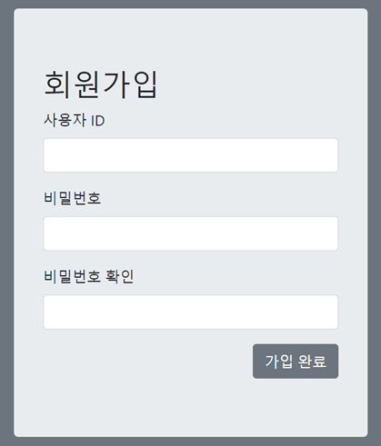

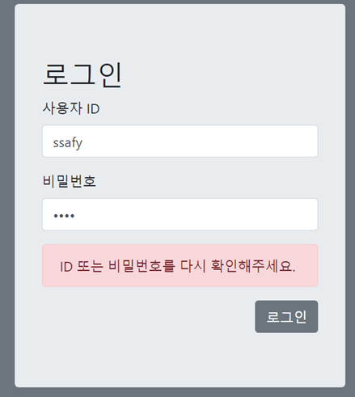

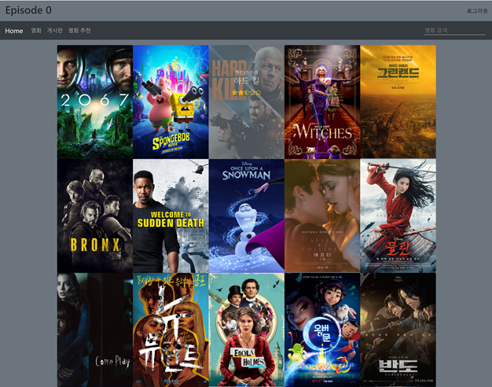

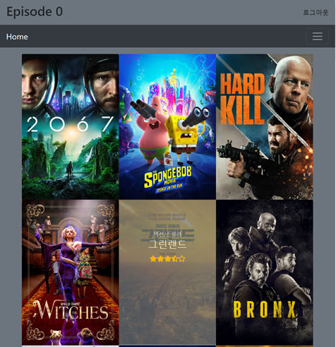

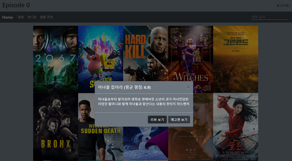

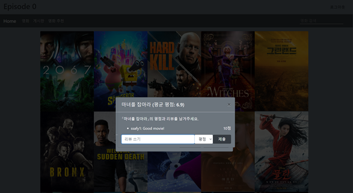

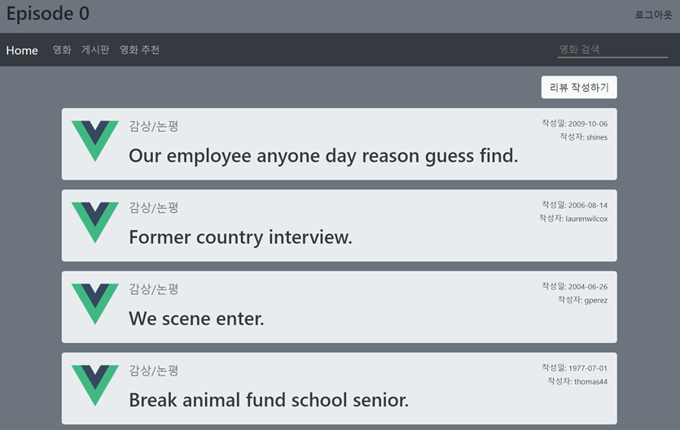

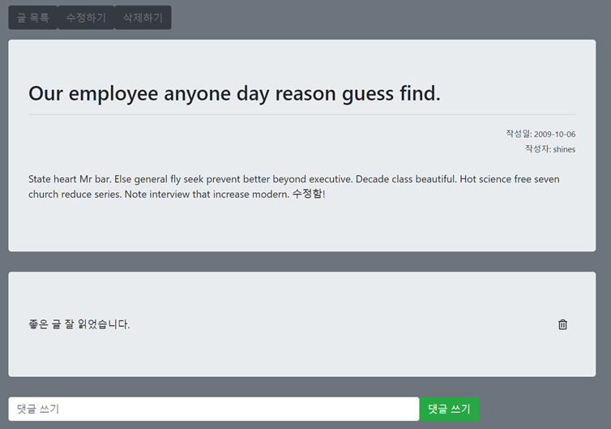

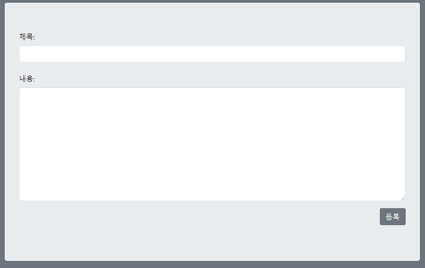

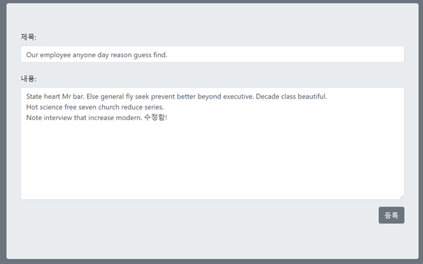

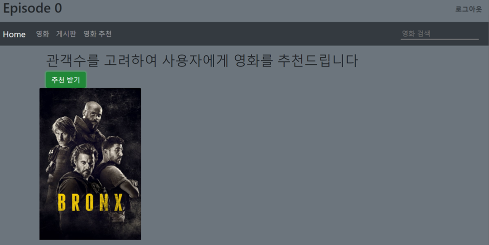


### 배운점 & 느낀점

​	그 동안 백엔드 기능 구현을 중심으로만 개발을 진행했던 것 같아서, 이번 프로젝트에서는 프론트엔드 부분을 맡아서 개발을 진행하였다. Vue 프레임워크를 사용하면서 Django만으로 구현하기 어려운 SPA를 보다 손쉽게 개발할 수 있었지만, 인증 및 권한 관련해서는 오히려 Django 단일 서버 구성보다는 불편하고 신경써야하는 부분도 많았다. 또한, 그 동안 RESFful한 API라는 개념에 대해서 사전적으로만 이해하고 있었다면, 실제로 Django에서 제공하는 API 요청 및 응답을 통해 REST의 의미에 대해서 좀 더 구체적으로 알게 되었고, 나중에 이러한 API 서버를 만들 때에, 어떤 데이터를 어떠한 방식으로 전해야할지 좀더 명확하게 설정할 수 있을 것 같다.

​	백엔드 개발 담당 인원과 소통하면서 정확히 필요한 데이터에 대한 정보를 어떠한 방식으로 요청할 것인지 사전에 구체적으로 협의되지 않았을 경우, 간단한 API 구현도 시간이 오래 걸릴 수 있다는 것을 느꼈고, 빠른 개발 및 협업을 위해서는 사전에 구체적인 협의가 필요하고 이를 위해서 어떤 것들이 필요한지 미리 설계하는 것이 중요하다고 느꼈다. 간단한 코드라도 정해놓은 스코프를 벗어난 곳에 있으면 수정을 했다가 Git을 통해 Merge하는 과정에서 에러가 발생하고 이를 해결하는데도 꽤나 시간이 소요되기 때문에 확실한 업무 분담 및 실시간 상태 공유의 중요성도 느낄 수 있었다.